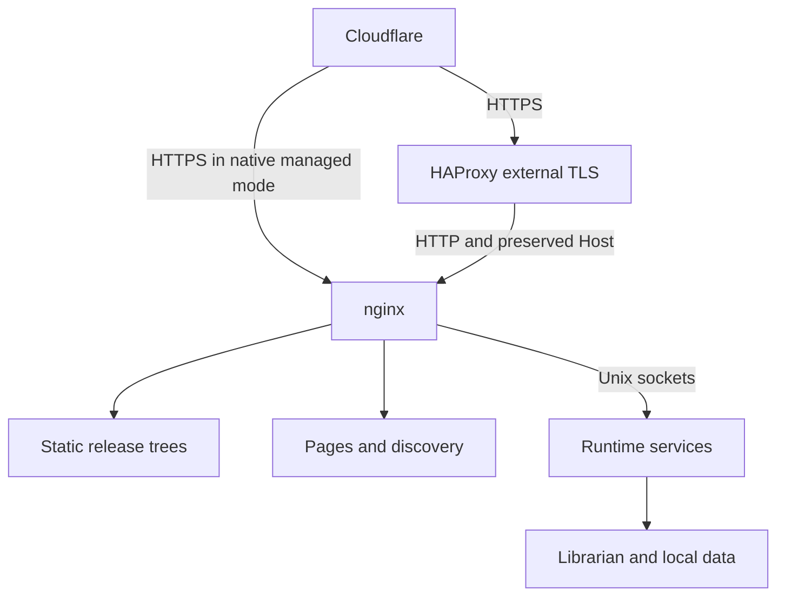

# Architecture

In Docker, nginx and all managed services run in one Linux system container
with systemd as PID 1. HAProxy stays on OPNsense. Native installation retains
local managed TLS or can use the external TLS path. nginx continues to enforce
methods, limits, bearer tokens, CORS, problem responses and origin caching.
See [deployment decisions](DEPLOYMENT_DECISIONS.md) for the shared objectives.

Static Git trees are authoritative. The exporter streams changed blobs and
hard-links unchanged blob identities into a new release, without parsing JSON
or calculating content/checksum hashes. Runtime applications read existing local
version directories and trust those same upstream-validated files.

A **domain** is a host name: one vhost, TLS at its selected terminator, one go-live. Its
**endpoints** are its version folders (`/v2/`), or the domain root itself
when it was set up without version folders (the label `root`). In the registry,
`/etc/getbible/endpoints/<domain>/endpoint.conf` describes the domain and
`versions/<label>.conf` its endpoints.

Static repository credentials are **per endpoint**, while the sync system
user, nginx vhost and certificate are per domain. Each endpoint selects a
dedicated SSH key for its repository URL; changing only a reference or source
folder preserves the key, while changing the URL selects another key. Both
scheduled syncs and access tests pass that key directly to SSH with ambient
configuration and agents disabled. URLs keep their real hostnames. This
allows `/v1/` and `/v2/` to use unrelated private repositories on the same
Git host without sharing a deploy key. Root's manager-update key is separate.

The key path is derived from the endpoint label and repository URL and passed
to its service as `GB_SYNC_KEY`. The sync helper requires this explicit key;
there is no domain-wide fallback identity. `deploy-key DOMAIN ENDPOINT`
prepares a missing key and shows its public half; `repo-access DOMAIN ENDPOINT`
tests it against the configured repository and reference. See
[STATIC_ENDPOINTS.md](STATIC_ENDPOINTS.md) for the operator workflow and the
shared user's security boundary.

## The tool

`getbible.sh` sources `src/lib/*.sh`, then dispatches a command or opens
the menu. The libraries:

| Library | Role |
| --- | --- |
| `core` | paths (all under `GB_PREFIX` for tests), logging, validators, atomic installs, backups, the ledger of installed hashes |
| `ui` | whiptail with plain-prompt and non-interactive fallbacks |
| `config`, `registry` | `KEY=value` files; the endpoint registry under `/etc/getbible/endpoints` |
| `users`, `systemd`, `certs`, `nginx` | system users and groups; units and timers; certbot over HTTP-01 or DNS-01 through Cloudflare, placeholder certificates for staged endpoints; render, stage, test, install, reload, drift |
| `access` | access modes, limits, tokens and their nginx snippets |
| `sync` | domain sync users; endpoint/repository deploy keys and access tests; per-endpoint sync units |
| `pages` | the files a domain publishes besides its data: pages, OpenAPI documents, favicon and icons, versions.json, and where each comes from (`PAGES.md`) |
| `platform`, `python` | host capability detection, reviewed standalone CPython distributions and immutable runtime releases |
| `logs`, `analytics`, `telegram`, `cloudflare` | rotation, reports, notifications, Cloudflare |
| `docs`, `endpoint`, `update`, `doctor`, `menu` | shared pieces of the documentation pages, the domain pipeline, update, host checks, the menu tree |
| `golive` | staged endpoints going live: preflight, certificate first, then the switch, Cloudflare DNS, verification |

Domain types live in `src/types/<type>/type.sh` and implement
`type_<type>_prepare`, `_render_locations`, `_finish`, `_remove`,
`_status`, `_deploy_cli`, `_deploy_interactive`, `_menu_items`,
`_menu_action`, and for the pages library `_endpoints` (the labels),
`_openapi_default`, `_render_docs` (the domain page),
`_render_endpoint_docs` and `_render_openapi`. `endpoint_apply` is the one
pipeline both share: protect shared-cache access, prepare a ready candidate
for every endpoint, publish the pages, render the nginx files, snapshot
routing, install/test/reload, certificate (two-phase TLS), commit activation,
retire old workers' backends, Cloudflare and state. Failed activation
restores prior nginx files and every endpoint's generation state.

A runtime domain runs one service per endpoint: `/opt/getbible/<kind>/<label>/`
holds its releases and generations, `getbible-<kind>-<label>-<generation>`
are its units, `/run/getbible/<kind>/<label>/` its sockets. The endpoint's
record (`versions/<label>.conf`) carries its settings, `APP_VERSION` (the
version the implementation speaks; differs from the label only for a root
endpoint). Every endpoint uses the paths above.

An endpoint carries `LIVE=true|false` in its `endpoint.conf` (absent means
live). A staged endpoint runs the same pipeline without the steps that touch
its public name: no edge-cache protection, no certificate request, no
Cloudflare DNS or rules. In managed TLS its vhost renders a self-signed
placeholder under `/etc/getbible/placeholder-certs`. In managed TLS,
`golive_run` obtains the
Let's Encrypt certificate first, then sets `LIVE=true`, applies (which now
includes Cloudflare), records `LIVE_AT` and verifies through the local nginx
with the real host name. A failed managed certificate leaves the endpoint
staged. External TLS verifies the local HTTP origin before DNS changes and
checks the public HTTPS route after activation; an incomplete public check
reports pending verification while preserving the active origin.

Helper programs in `src/bin/` are installed to `/usr/local/lib/getbible`
for timers and hooks that run as other users: `getbible-sync`,
`getbible-export-tree`, `getbible-notify`, `getbible-logrotate-hook`. The
rest (`getbible-render`, `getbible-tokens`, `getbible-analytics`,
`getbible-cloudflare`) run from the checkout.

## nginx layout

- `conf.d/getbible-http.conf`: the JSON log format and the maps that turn
  a bearer token into a caller id and switch the limit key off for it.
- `conf.d/getbible-ep-<slug>.conf`: the endpoint's limit zones and proxy
  cache.
- `snippets/getbible/`: TLS policy, headers, HTML headers, problem
  documents, proxy settings, ACME location.
- `getbible/<domain>/`: `server.conf` (tuning), `limits.conf`, `auth.conf`;
  `getbible/tokens/<slug>.map` and `getbible/token-validity/<slug>.map` enforce
  endpoint identity and per-request UTC token expiry. Map directories are
  root-only; maps are updated with the shared configuration.
- `sites-available/<domain>.conf`: the vhost, port 80 with the ACME
  location and a redirect, port 443 with everything above, the exact
  locations of the domain page, favicon, `/img/`, `versions.json` and `/openapi.json`,
  and the type's locations: per endpoint its page and OpenAPI document (exact
  locations) and its tree (`^~ /vN/`, static) or its service (`= /vN`,
  `^~ /vN/`, runtime), then health and the fallback. A root endpoint's tree or
  service takes `/` itself.

External TLS renders the complete serving vhost on the configured HTTP origin
port, without the local certificate or unconditional HTTPS redirect. Multiple
domains share that listener. A separate configured proxy trust boundary
normalizes the public scheme and client address; the runtime sees nginx's
normalized values rather than trusting an arbitrary number of proxy hops.

## Docker image and lifecycle

The image contains immutable manager source under `/usr/share/getbible/api`.
`/usr/local/bin/getbible` links to its entry point. Its prepared Python and
dependency artifacts let endpoint deployment create releases offline; the
native path retains reviewed downloads. Runtime paths and their retained
interpreters stay stable through container replacement for rollback.

Bootstrap prepares mounted directories and restores recorded UIDs/GIDs before
systemd activates services. Persisted configuration, units and active generation
identities describe the saved installation; image replacement does not mean
reapplying every domain or updating every endpoint. Temporary sockets and PID
files are recreated under `/run`. Data mount roots include static release
targets and their relative symlinks, preserving atomic rename and hard links.

The Docker daemon enforces the container's aggregate resource ceiling. The
manager's runtime allocation sits inside it and accounts for shared overhead
and update generations. Service-level systemd limits remain in force. Docker
mode requires the host's cgroup/namespace support for these controls; see the
explicit host requirements and permissions in [DOCKER.md](DOCKER.md).

## State

`/etc/getbible` is configuration, `/var/lib/getbible` is state (ledger,
per-endpoint state, sync homes), `/var/backups/getbible` holds backup sets,
`/var/log/getbible` holds logs. Data roots are `/srv/getbible` (static) and
`/opt/getbible` (runtime releases), with librarian caches under
`/var/cache/getbible/<kind>`; `/var/www/getbible/<domain>` holds the
generated and operator-maintained pages and documents and the icons the
pages show (`img/`, copied from the repository's `img/` unless replaced);
`/etc/getbible/favicon.ico` and `logo.EXT` hold an operator's replacements.

Runtime code releases and deployment generations are distinct. A generation
holds environment, service/socket configuration and a release reference;
configuration-only changes can reuse code while creating a new ready process.
`active` and `previous` preserve complete deployment identities. Owned CPython
installations are content-identified by version, architecture, build and
checksum under `/opt/getbible/python`; OS package updates do not rewrite them.
